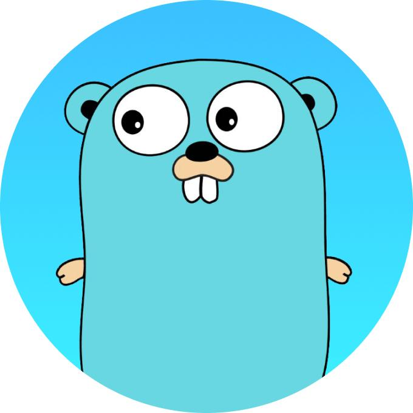
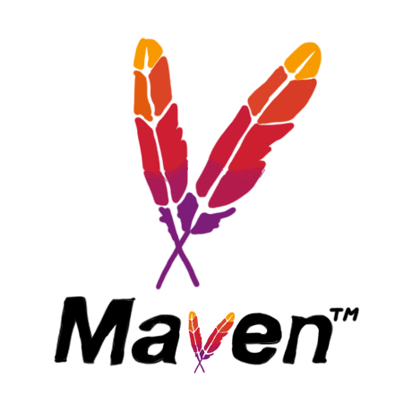

### Hi there! My name is Daulet 👋

### How to reach me:

  
  
   
  
  
  
  ### 🛠 &nbsp;Languages and Tools :

 

 

  
  ## My projects:
### :heavy_check_mark: Games Store

### :heavy_check_mark: Book Shop

### :heavy_check_mark: Torrent App

### My stats:
  
  
  
